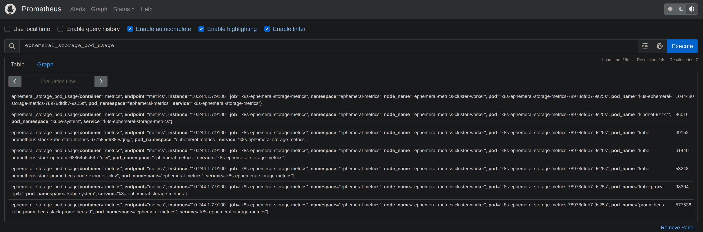

# K8s Ephemeral Storage Metrics.

The goal of this project is to export ephemeral storage metric usage per pod to Prometheus that is address in this 
issue [Here](https://github.com/kubernetes/kubernetes/issues/69507)

Currently, this image is not being hosted and so you have to build it yourself at the moment. 

