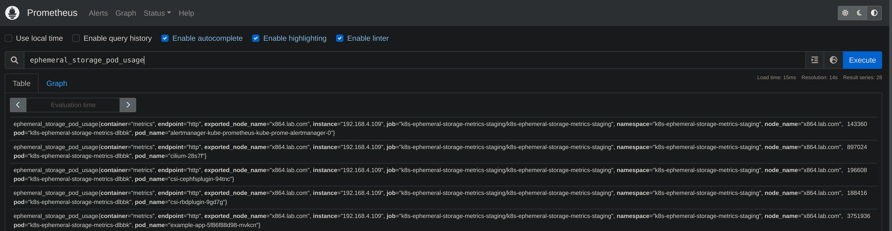

# K8s Ephemeral Storage Metrics

[](https://opensource.org/licenses/MIT)
[](https://github.com/jmcgrath207/k8s-ephemeral-storage-metrics/actions)
[](https://artifacthub.io/packages/helm/k8s-ephemeral-storage-metrics/k8s-ephemeral-storage-metrics)


A prometheus ephemeral storage metric exporter for pods, containers,
nodes, and volumes.

This project was created
to address lack of monitoring in [Kubernetes](https://github.com/kubernetes/kubernetes/issues/69507)

This project does not monitor CSI backed ephemeral storage ex. [Generic ephemeral volumes](https://kubernetes.io/docs/concepts/storage/ephemeral-volumes/#generic-ephemeral-volumes)



## Overview

A Prometheus exporter for Kubernetes ephemeral storage. Emits per-node, per-pod, per-container, and per-volume metrics sourced from the kubelet `/stats/summary` endpoint (default) or the Kubernetes apiserver (`SCRAPE_FROM_KUBELET=false`).

### Metric groups

- **Node-level**: available / capacity / percentage of node ephemeral storage
- **Pod-level**: usage (bytes), inodes / inodes free / inodes used
- **Per-container rootfs + logs**: used / available / capacity bytes, usage percentage, inodes / inodes free / inodes used
- **Per-container volume (emptyDir)**: usage bytes, limit percentage

### Labels

Every metric carries `node_name`. Pod/container metrics add `pod_name`, `pod_namespace`, `container`. Volume metrics add `volume_name`, `mount_path`.

### DaemonSet vs Deployment

- **DaemonSet** (default): one exporter per node, scrapes local kubelet. Lighter apiserver load. Set `deploy_type: DaemonSet`.
- **Deployment**: single controller, lists all pods/nodes. Use `deploy_type: Deployment` plus optional `node_label_selector` to filter nodes (e.g. `type=virtual-kubelet` to exclude virtual nodes).

For large clusters (2K+ nodes), set `list_pods_with_cache: true` to read pod lists from the apiserver cache and reduce apiserver pressure. Pair with `deploy_type: DaemonSet` so each pod only lists its own node's pods (`spec.nodeName` fieldSelector).

### Not monitored

This project does not monitor CSI-backed ephemeral storage, e.g. [Generic ephemeral volumes](https://kubernetes.io/docs/concepts/storage/ephemeral-volumes/#generic-ephemeral-volumes).


## Helm Install

```bash
helm repo add k8s-ephemeral-storage-metrics https://jmcgrath207.github.io/k8s-ephemeral-storage-metrics/chart
helm repo update
helm upgrade --install my-deployment k8s-ephemeral-storage-metrics/k8s-ephemeral-storage-metrics
```

## Values

| Key | Type | Default | Description |
|-----|------|---------|-------------|
| affinity | object | `{}` |  |
| client_go_burst | int | `10` | Maximum burst for throttle. |
| client_go_qps | int | `5` | QPS indicates the maximum QPS to the master from this client. |
| containerSecurityContext.allowPrivilegeEscalation | bool | `false` |  |
| containerSecurityContext.capabilities.drop[0] | string | `"ALL"` |  |
| containerSecurityContext.privileged | bool | `false` |  |
| containerSecurityContext.readOnlyRootFilesystem | bool | `false` |  |
| containerSecurityContext.runAsNonRoot | bool | `true` |  |
| deploy_labels | object | `{}` | Set additional labels for the Deployment/Daemonset |
| deploy_type | string | `"Deployment"` | Set as Deployment for single controller to query all nodes or Daemonset |
| dev | object | `{"enabled":false,"grow":{"image":"ghcr.io/jmcgrath207/k8s-ephemeral-storage-grow-test:latest","imagePullPolicy":"IfNotPresent"},"shrink":{"image":"ghcr.io/jmcgrath207/k8s-ephemeral-storage-shrink-test:latest","imagePullPolicy":"IfNotPresent"}}` | For local development or testing that will deploy grow and shrink pods and debug service |
| fullnameOverride | string | `""` | Override the full name of the chart |
| image.imagePullPolicy | string | `"IfNotPresent"` |  |
| image.imagePullSecrets | list | `[]` |  |
| image.repository | string | `"ghcr.io/jmcgrath207/k8s-ephemeral-storage-metrics"` |  |
| image.tag | string | `"1.20.0"` |  |
| interval | int | `15` | Polling node rate for exporter |
| kubeconfig | string | `""` | Path to kubeconfig file; leave empty for in-cluster config |
| kubelet | object | `{"insecure":false,"readOnlyPort":0,"scrape":false}` | Scrape metrics through kubelet instead of kube api |
| list_pods_with_cache | bool | `false` | Use Kubernetes api server cache for pod list requests (reduces api server pressure at scale) |
| log_level | string | `"info"` |  |
| max_node_concurrency | int | `10` | Max number of concurrent query requests to the kubernetes API. |
| metrics | object | `{"adjusted_polling_rate":false,"ephemeral_storage_container_limit_percentage":true,"ephemeral_storage_container_logs_usage":true,"ephemeral_storage_container_rootfs_usage":true,"ephemeral_storage_container_volume_limit_percentage":true,"ephemeral_storage_container_volume_usage":true,"ephemeral_storage_inodes":true,"ephemeral_storage_node_available":true,"ephemeral_storage_node_capacity":true,"ephemeral_storage_node_percentage":true,"ephemeral_storage_pod_usage":true,"gc_batch_size":500,"gc_enabled":false,"gc_interval":5,"port":9100}` | Set metrics you want to enable |
| metrics.adjusted_polling_rate | bool | `false` | Create the ephemeral_storage_adjusted_polling_rate metrics to report Adjusted Poll Rate in milliseconds. Typically used for testing. |
| metrics.ephemeral_storage_container_limit_percentage | bool | `true` | Percentage of ephemeral storage used by a container in a pod |
| metrics.ephemeral_storage_container_logs_usage | bool | `true` | Current logs bytes used/available/capacity for a container in a pod |
| metrics.ephemeral_storage_container_rootfs_usage | bool | `true` | Current rootfs bytes used/available/capacity for a container in a pod |
| metrics.ephemeral_storage_container_volume_limit_percentage | bool | `true` | Percentage of ephemeral storage used by a container's volume in a pod |
| metrics.ephemeral_storage_container_volume_usage | bool | `true` | Current ephemeral storage used by a container's volume in a pod |
| metrics.ephemeral_storage_inodes | bool | `true` | Current ephemeral inode usage of pod |
| metrics.ephemeral_storage_node_available | bool | `true` | Available ephemeral storage for a node |
| metrics.ephemeral_storage_node_capacity | bool | `true` | Capacity of ephemeral storage for a node |
| metrics.ephemeral_storage_node_percentage | bool | `true` | Percentage of ephemeral storage used on a node |
| metrics.ephemeral_storage_pod_usage | bool | `true` | Current ephemeral byte usage of pod |
| metrics.gc_batch_size | int | `500` | The amount of resource to fetch from kubernetes at once when performing garbage collection |
| metrics.gc_enabled | bool | `false` | Enable garbage collection for metrics |
| metrics.gc_interval | int | `5` | The interval, in minutes, to perform garbage collection |
| metrics.port | int | `9100` | Adjust the metric port as needed (default 9100) |
| nameOverride | string | `""` | Override the name of the chart |
| nodeSelector | object | `{}` |  |
| node_label_selector | string | `""` | Label selector to filter watched nodes in Deployment mode (e.g. type=virtual-kubelet) |
| podAnnotations | object | `{}` |  |
| podSecurityContext.runAsNonRoot | bool | `true` |  |
| podSecurityContext.seccompProfile.type | string | `"RuntimeDefault"` |  |
| pod_labels | object | `{}` | Set additional labels for the Pods |
| pprof | bool | `false` | Enable Pprof |
| priorityClassName | string | `nil` |  |
| probes | object | `{"liveness":{"failureThreshold":10,"initialDelaySeconds":10,"periodSeconds":10,"successThreshold":1,"timeoutSeconds":30},"readiness":{"failureThreshold":10,"periodSeconds":10,"successThreshold":1,"timeoutSeconds":1}}` | Liveness and Readiness probe configuration |
| probes.liveness | object | `{"failureThreshold":10,"initialDelaySeconds":10,"periodSeconds":10,"successThreshold":1,"timeoutSeconds":30}` | Liveness probe configuration |
| probes.liveness.failureThreshold | int | `10` | Number of consecutive failures required to consider the container as not ready |
| probes.liveness.initialDelaySeconds | int | `10` | Delay before the first probe is initiated |
| probes.liveness.periodSeconds | int | `10` | How often to perform the probe |
| probes.liveness.successThreshold | int | `1` | Minimum consecutive successes for the probe to be considered successful after having failed |
| probes.liveness.timeoutSeconds | int | `30` | Number of seconds after which the probe times out |
| probes.readiness | object | `{"failureThreshold":10,"periodSeconds":10,"successThreshold":1,"timeoutSeconds":1}` | Readiness probe configuration |
| probes.readiness.failureThreshold | int | `10` | Number of consecutive failures required to consider the container as not ready |
| probes.readiness.periodSeconds | int | `10` | How often to perform the probe |
| probes.readiness.successThreshold | int | `1` | Minimum consecutive successes for the probe to be considered successful after having failed |
| probes.readiness.timeoutSeconds | int | `1` | Number of seconds after which the probe times out |
| prometheus.additionalLabels | object | `{}` | Add labels to the PrometheusRule.Spec |
| prometheus.enable | bool | `true` |  |
| prometheus.release | string | `"kube-prometheus-stack"` |  |
| prometheus.rules.enable | bool | `false` | Create PrometheusRules firing alerts when out of ephemeral storage |
| prometheus.rules.labels | object | `{"severity":"warning"}` | What additional labels to set on alerts |
| prometheus.rules.predictFilledHours | int | `12` | How many hours in the future to predict filling up of a volume |
| prometheus.rules.predictMinCurrentUsage | float | `33.3` | What percentage of limit must be used right now to predict filling up of a volume |
| rbac | object | `{"create":true}` | RBAC configuration |
| resources | object | `{}` | Resource requests and limits for the container |
| revisionHistoryLimit | int | `10` | Revision history limit for the Deployment |
| serviceAccount | object | `{"create":true,"name":null}` | Service Account configuration |
| serviceAnnotations | object | `{}` | Annotations to add to the metrics Service |
| serviceMonitor | object | `{"additionalLabels":{},"enable":true,"metricRelabelings":[],"podTargetLabels":[],"relabelings":[],"targetLabels":[]}` | Configure the Service Monitor |
| serviceMonitor.additionalLabels | object | `{}` | Add labels to the ServiceMonitor.Spec |
| serviceMonitor.metricRelabelings | list | `[]` | Set metricRelabelings as per https://github.com/prometheus-operator/prometheus-operator/blob/main/Documentation/api.md#monitoring.coreos.com/v1.RelabelConfig |
| serviceMonitor.podTargetLabels | list | `[]` | Set podTargetLabels as per https://github.com/prometheus-operator/prometheus-operator/blob/main/Documentation/api.md#monitoring.coreos.com/v1.ServiceMonitorSpec |
| serviceMonitor.relabelings | list | `[]` | Set relabelings as per https://github.com/prometheus-operator/prometheus-operator/blob/main/Documentation/api.md#monitoring.coreos.com/v1.RelabelConfig |
| serviceMonitor.targetLabels | list | `[]` | Set targetLabels as per https://github.com/prometheus-operator/prometheus-operator/blob/main/Documentation/api.md#monitoring.coreos.com/v1.ServiceMonitorSpec |
| tolerations | list | `[]` |  |

## Prometheus alert rules

To prevent from multiple kind of alerts being fired for a single container or
emptyDir volume when both `prometheus.enable` and `prometheus.rules.enable` are
on, add the following [inhibition
rules](https://prometheus.io/docs/alerting/latest/configuration/#inhibition-related-settings)
to your Alert Manager config:

```yaml
- source_matchers:
    - alertname="EphemeralStorageVolumeFilledUp"
  target_matchers:
    - severity="warning"
    - alertname="EphemeralStorageVolumeFillingUp"
  equal:
    - pod_namespace
    - pod_name
    - volume_name
- source_matchers:
    - alertname="ContainerEphemeralStorageUsageAtLimit"
  target_matchers:
    - severity="warning"
    - alertname="ContainerEphemeralStorageUsageReachingLimit"
  equal:
    - pod_namespace
    - pod_name
    - exported_container
```

## Prerequisites

For local development / testing, install:

- **Docker** — image builds
- **minikube** — cluster (e2e is hardcoded to minikube node name; see [Contribute](#contribute))
- **helm 3.x** — chart install/upgrade
- **kubectl** — cluster interaction
- **Go 1.26.5** — matches `go.mod` toolchain

`bin/{ginkgo,crane,helm-docs,gosec,govulncheck}` are auto-installed by the Makefile on first use.

## ENV modes

`scripts/deploy.sh` keys behavior off `ENV={local|debug|e2e|e2e-debug|test}`. The `make deploy_*` targets set this for you:

| Mode | Command | Behavior |
|---|---|---|
| `local` (default) | `make deploy_local` | Build → helm install → port-forward :9100 → tail logs |
| `debug` | `make deploy_debug` | Delve build → port-forward :30002 → connect dlv |
| `e2e` | `make deploy_e2e` | Build → helm install → ginkgo -v -r tests/e2e (~15-25 min) |
| `e2e-debug` | `make deploy_e2e_debug` | Build → helm install → hold for manual ginkgo/debug |
| `test` | `make deploy_test` | Helm install with `chart/test-values.yaml` overrides |

## Development tooling

| Task | Command |
|---|---|
| Format | `make fmt` |
| Vet | `make vet` |
| Security scan | `make gosec` |
| Vulnerability scan | `make govulncheck` |
| Helm render check (8 k8s versions) | `make test-helm-render` |
| Regenerate docs (after `values.yaml` change) | `make helm-docs` |
| Unit tests (~2s, no cluster) | `make test-unit` |

Run `make fmt vet test-unit test-helm-render` before opening a PR.

## Contribute

**Prereqs**: Docker, minikube, helm, kubectl, Go 1.26.5.

**Fork + branch** from `master`.

### Unit tests (no cluster)
```bash
make test-unit
```

### Full e2e (~15-25 min)
```bash
make minikube_new_docker    # fresh minikube: calico CNI, registry addon, 3900MB
make deploy_e2e             # build 3 images, helm install, ginkgo tests
```

### Local dev (no e2e)
```bash
make deploy_local           # build + helm install + port-forward :9100 + tail logs
```

### Local dev with Delve
```bash
make deploy_debug           # port-forward :30002
```
Connect `localhost:30002` with [delve](https://github.com/go-delve/delve) or your IDE.

### Debug e2e
```bash
make deploy_e2e_debug       # build + helm install, then holds
```
Then run ginkgo manually against [deployment_test.go](tests/e2e/deployment_test.go).

### Pre-PR gate
```bash
make fmt vet test-unit test-helm-render
```

If `chart/values.yaml` changed, also run `make helm-docs` and commit the regenerated `README.md` + `chart/README.md`.

### kind alternative

`scripts/create_kind.sh` (no Makefile wrapper) brings up a kind cluster. **e2e will fail** because `tests/e2e/deployment_test.go` hardcodes `node_name="minikube"` in regexes. Use kind for dev iteration only.

## Troubleshooting

| Symptom | Fix |
|---|---|
| Port conflict on :9100 / :30002 / :6060 | `sudo ss -aK '( sport = :PORT )'` — `trap_func` cleans on normal exit only |
| "registry endpoint is not healthy" during `minikube_new_docker` | `create-minikube.sh` retries every 5s; if stuck >2 min, `minikube delete && make minikube_new_docker` |
| e2e hang on "Waiting for k8s-ephemeral-storage-metrics pod" | Minikube needs 3900MB memory floor. Or image push failed — check minikube registry |
| e2e hang on "Waiting for grow-test pod" | grow-test image not pushed; check `crane push` output in `deploy.sh` |
| ginkgo panics on run | Makefile pin out of sync with go.mod — `rm bin/ginkgo && make ginkgo` (pin must match `github.com/onsi/ginkgo/v2` in go.mod, currently v2.32.0) |
| shrink-test e2e flakes | Shrinking reflects slowly from Node API (up to 5 min). Test waits for currentPodSize ≥ 11MB first |

## License

This project is licensed under the [MIT License](https://opensource.org/licenses/MIT). See the `LICENSE` file for more details.
